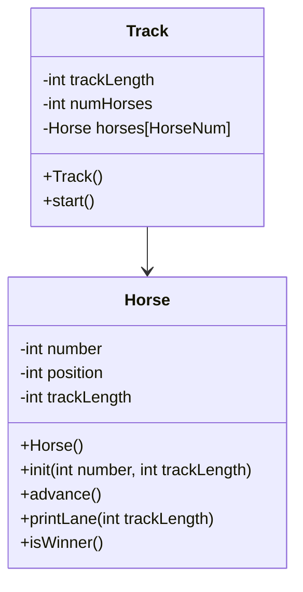

# Track()

```
in header
    set constant number of horses to 5
    set constant track lenght to 15
in constructor
    for each horse:
        init horse
```

# Track.start()
```
keepGoing = true
whike keepGoing:
    for i in horses:
        advance()
        printLane()
        if isWinner = true:
            print("Horse ___ Wins!")
            keepGoing = false
```

# Horse()
```
number = 0
position = 0
trackLength = 15
```

# Horse.init(number, trackLength)
```
hNumber = number
hTrackLength = trackLength
hPosition = 0
```

# Horse.advance()
```
flip coin [either 1 or 0]

position += coin
```

# Horse.printLane()
```
for 15 times:
    if position = hPosition:
        print number
    else:
        print "."
```
