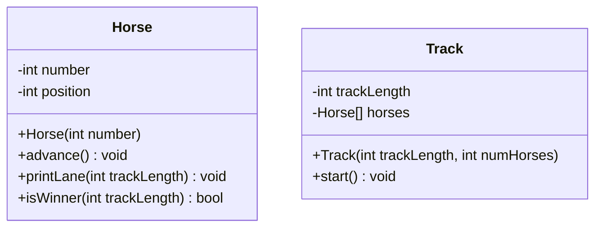

```mermaid

classDiagram
    class Horse {
        -int number
        -int position
        +Horse(int number)
        +advance() void
        +printLane(int trackLength) void
        +isWinner(int trackLength) bool
    }

    class Track {
        -int trackLength
        -Horse[] horses
        +Track(int trackLength, int numHorses)
        +start() void
    }

```
